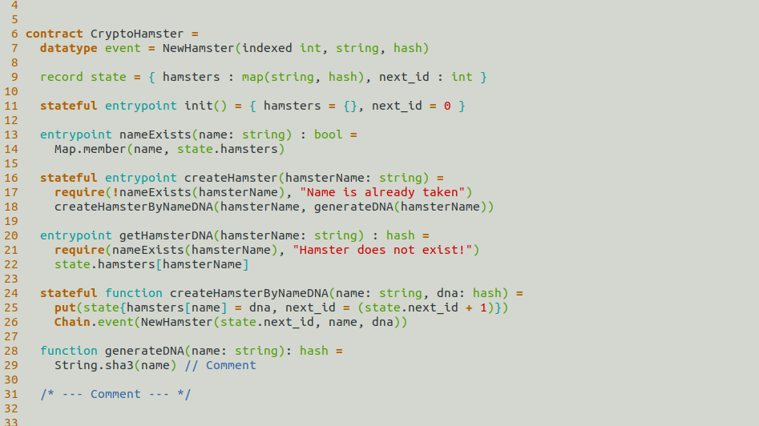

## Sophia VIM Syntax

Sophia is not natively supported by vim and it's file extension "aes" is
interpreted as a plain text by VIM, hence a little configuration is required to
spice things up. Follow the steps below to add a syntax highlighting feature for
Sophia (aes) in Vim.

1. Add a file detect type for Sophia files using either of the options below:
    - Add a aes.vim file to ftdetect
    ```vim
    " ~/.vim/after/ftdetect/aes.vim
    autocmd BufNewFile,BufRead *.aes setfiletype aes
    ```
    - Add a filetype config file to vim
    ```vim
    " ~/.vim/filetype.vim
    if exists("did_load_filetypes")
      finish
    endif
    augroup filetypedetect
      au! BufRead,BufNewFile *.aes  setfiletype aes
    augroup END
    ```
2. Copy the syntax file to the syntax directory (~/.vim/after/syntax/aes.vim)
3. Restart VIM for the changes to take effect

> N.B: The syntax highlighting works well with any color scheme.

### Neodark colorscheme


### One colorscheme


### Morning colorscheme




